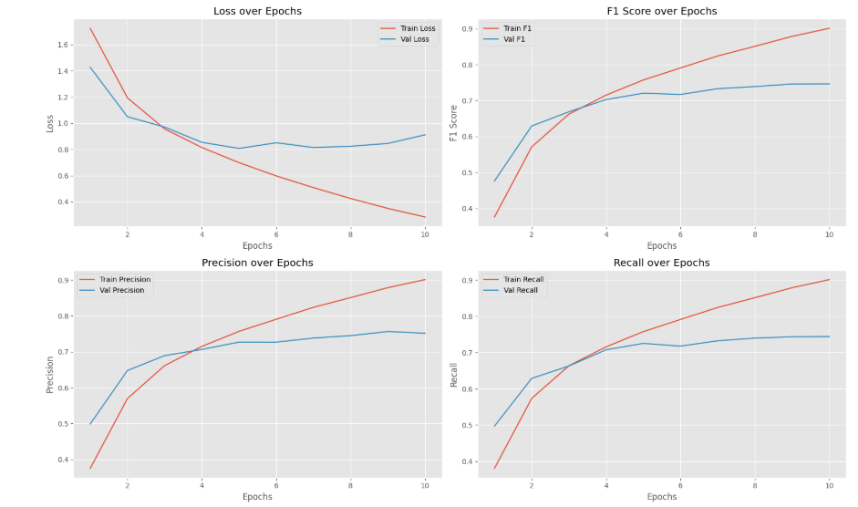
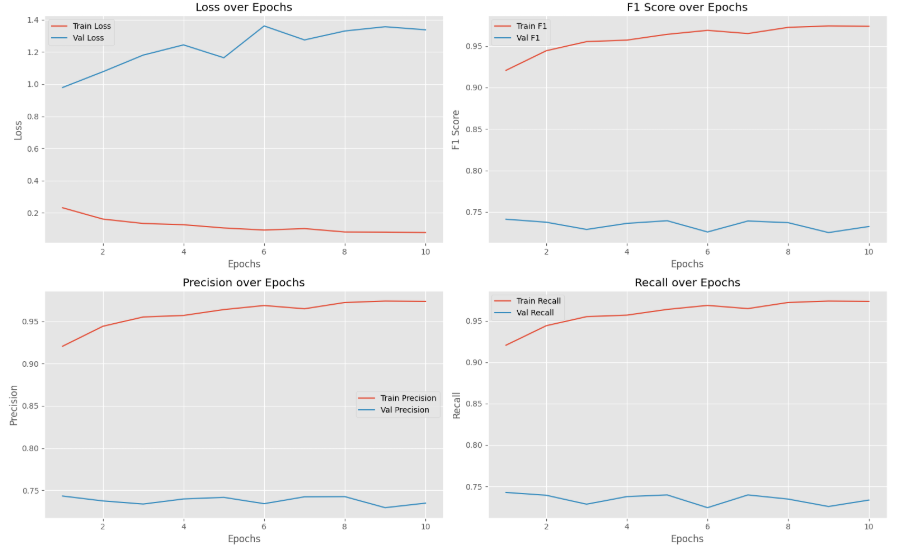
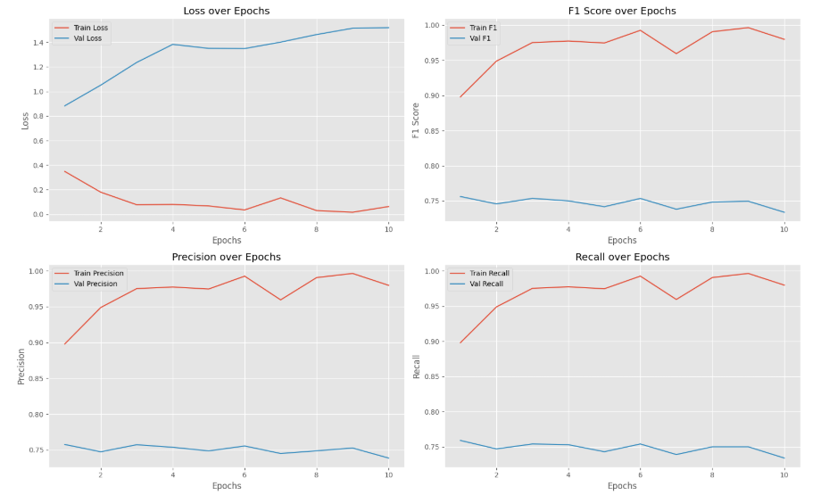

ФИО: Привалов Андрей Андреевич

Предмет: Обработка и генерация изображений

Задача: Self-supervised learning

Классы:

- airplane — самолеты
- automobile — автомобили
- bird — птицы
- cat — кошки
- deer — олени
- dog — собаки
- frog — лягушки
- horse — лошади
- ship — корабли
- truck — грузовики
  
Датасет: CIFAR-10

Архитектура: ResNet-18

Гиперпараметры:
- batch size: 64
- optimizer: Adam
- learning rate: 0.01
- loss: cross-entropy
- device: cuda
- epochs: 10

### Эксперимент с использованием 100%, 50% и 10% размеченной выборки

В рамках задания модель обучалась на 100%, 50% и 10% от исходной размеченной выборки.
[Ноутбук](1_task.ipynb)
Результаты:

- **100% выборка**:  
  Модель показала ожидаемые результаты: низкий валидационный лосс и высокие метрики качества
  

- **50% выборка**:  
  Уменьшение выборки до 50% привело к значительному росту валидационного лосса. Метрики качества снизились.  
  Вероятно, это связано с дисбалансом в стратификации или способом обрезки данных. Для улучшения результатов можно попробовать более аккуратную стратификацию или аугментацию.
  

- **10% выборка**:  
  При 10% выборки наблюдалось дальнейшее ухудшение: валидационный лосс вырос, а метрики снизились. Результаты аналогичны случаю с 50%, не с таким выраженным ухудшением.
  

### Self-Supervised Learning (SSL) для предобучения Feature Extractor

Для улучшения качества feature extractor модели был применен метод Self-Supervised Learning (SSL) на всем датасете без использования разметки. В качестве метода SSL использовался **BYOL (Bootstrap Your Own Latent)**.
[Ноутбук](2_task.ipynb)
#### Детали обучения:
- **Метод**: BYOL (Bootstrap Your Own Latent) — метод контрастивного обучения, который позволяет обучать модель на неразмеченных данных, создавая полезные представления (embeddings) для последующего обучения с учителем.
- **Количество эпох**: 20.
- **Выбор лучшей модели**: На 19-й эпохе был достигнут наилучший результат по качеству feature extractor, поэтому модель с этой эпохи была выбрана для дальнейшего использования.

### Использование предобученного Feature Extractor на N% размеченной выборки
[Ноутбук](3_task.ipynb)
- Предобученный feature extractor не дал существенного улучшения качества по сравнению с baseline-моделью. Метрики оказались немного хуже, но близки к baseline.
- Лосс на обучении и валидации снижался быстрее, чем в baseline-модели. Это связано с тем, что feature extractor уже был адаптирован к данным благодаря предобучению на всем датасете с использованием BYOL.
