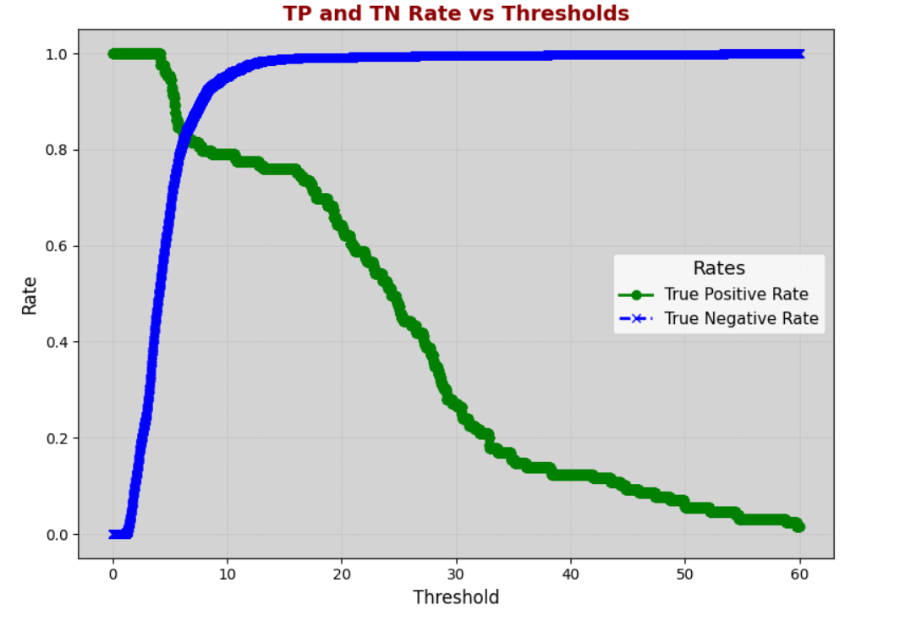

ФИО: Привалов Андрей Андреевич

Предмет: Обработка и генерация изображений

Тема: Детекция аномалий  
Имеются изображения технологического процесса разлива металлических цилиндров. Есть риск нарушения технологии: когда стенки цилиндра не успевают застывать и трескаются, незастывший металл выливается, не образуя требуемую заготовку. Необходимо оперативно определить лунку, где произошел пролив, при этом пролив - довольно редкое явление, гораздо больше изображений без пролива в лунке.

Задача: построить модель на основе автоэнкодера, определяющую состояние лунки:
- пролив
- не пролив.

[ноутбук](./hw_2.ipynb)

Результаты экспериментов:

1. Автоэнкодер из лекции (бейзлайн решение)  
   True Positive Rate: 0.791, True Negative Rate: 0.958, Threshold: 10.486000000000002
   

   Вывод: Данная модель показала высокий показатель True Negative Rate (0.958), что свидетельствует о способности модели эффективно распознавать нормальные состояния. Однако показатель True Positive Rate равен 0.791, что означает, что модель пропускает часть случаев с проливом. Это решение является бейзлайном и демонстрирует базовый уровень производительности, от которого можно отталкиваться при улучшении.

3. VAE  
   True Positive Rate: 0.89, True Negative Rate: 0.90, Threshold: 16.66
   

   Вывод: Модель показала более сбалансированные результаты: True Positive Rate – 0.89, True Negative Rate – 0.90. Это говорит о лучшей способности модели обнаруживать проливы по сравнению с базовым автоэнкодером, но с некоторым снижением качества определения нормального состояния. Увеличение порога (Threshold = 16.66) также указывает на то, что модель лучше отделяет норму от аномалии.

5. Автоэнкодер со сверткой
   True Positive Rate: 0.93, True Negative Rate: 0.77, Threshold: 0.6760000000000002
   

   Вывод: Данная модель продемонстрировала самый высокий True Positive Rate (0.93), что свидетельствует о высокой чувствительности к проливам. Однако True Negative Rate составил 0.77, что говорит о частых ложных срабатываниях. Низкое значение порога (Threshold = 0.676) может быть связано с особенностями архитектуры и способностью модели извлекать более сложные признаки на основе сверток.

Общий вывод: Результаты работы показывают, что каждая из рассмотренных архитектур имеет свои сильные и слабые стороны, и дальнейшая работа должна быть направлена на их комбинацию или развитие наиболее перспективных подходов.

